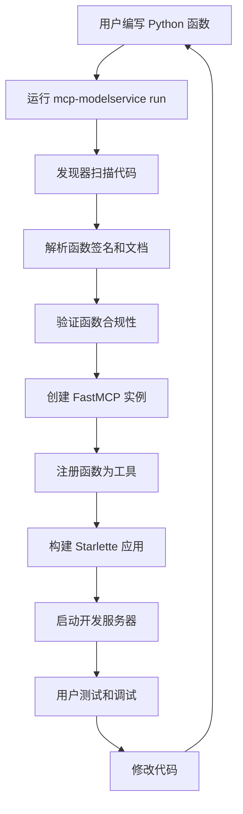
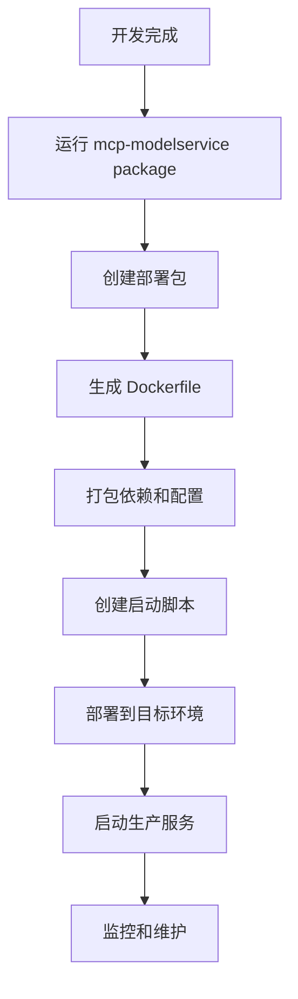
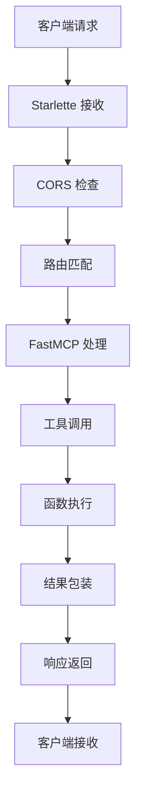

# 🏗️ MCP ModelService SDK 架构概览

本文档提供 MCP ModelService SDK 的整体架构概览，帮助您理解系统的核心组件和工作流程。

## 📋 目录

- [系统架构图](#系统架构图)
- [核心组件](#核心组件)
- [工作流程](#工作流程)
- [技术栈](#技术栈)
- [设计原则](#设计原则)

## 系统架构图

```
                    MCP ModelService SDK 架构
                         
    ┌─────────────────────────────────────────────────────────────┐
    │                    用户 Python 代码                          │
    │  ┌─────────────┐  ┌─────────────┐  ┌─────────────┐          │
    │  │  math.py    │  │  text.py    │  │  data.py    │          │
    │  │ def add()   │  │ def clean() │  │ def parse() │          │
    │  │ def sub()   │  │ def format()│  │ def export()│          │
    │  └─────────────┘  └─────────────┘  └─────────────┘          │
    └─────────────────────────────────────────────────────────────┘
                                │
                                ▼
    ┌─────────────────────────────────────────────────────────────┐
    │                  发现与解析层                                │
    │  ┌─────────────────────────────────────────────────────────┐ │
    │  │            函数发现器 (Discovery)                      │ │
    │  │  • 扫描 Python 文件                                   │ │
    │  │  • 提取函数定义                                       │ │
    │  │  • 分析类型注解和文档                                 │ │
    │  └─────────────────────────────────────────────────────────┘ │
    └─────────────────────────────────────────────────────────────┘
                                │
                                ▼
    ┌─────────────────────────────────────────────────────────────┐
    │                   转换与包装层                               │
    │  ┌─────────────────┐         ┌─────────────────────────────┐ │
    │  │   验证器        │         │       工具包装器             │ │
    │  │ • 输入验证      │         │ • FastMCP 工具注册          │ │
    │  │ • 类型检查      │         │ • 错误处理                   │ │
    │  │ • 安全检查      │         │ • 响应格式化                │ │
    │  └─────────────────┘         └─────────────────────────────┘ │
    └─────────────────────────────────────────────────────────────┘
                                │
                                ▼
    ┌─────────────────────────────────────────────────────────────┐
    │                    服务编排层                                │
    │                                                            │
    │  ┌─────────────────┐         ┌─────────────────────────────┐ │
    │  │  Composed 模式   │   OR    │       Routed 模式           │ │
    │  │                 │         │                             │ │
    │  │ ┌─────────────┐ │         │ ┌─────────┐ ┌─────────────┐ │ │
    │  │ │   主 MCP    │ │         │ │FastMCP A│ │ FastMCP B   │ │ │
    │  │ │   实例      │ │         │ │         │ │             │ │ │
    │  │ │  ┌─────┐    │ │         │ │ Route   │ │ Route       │ │ │
    │  │ │  │sub A│    │ │         │ │ /math   │ │ /text       │ │ │
    │  │ │  │sub B│    │ │         │ └─────────┘ └─────────────┘ │ │
    │  │ │  │sub C│    │ │         │                             │ │
    │  │ │  └─────┘    │ │         │                             │ │
    │  │ └─────────────┘ │         │                             │ │
    │  └─────────────────┘         └─────────────────────────────┘ │
    └─────────────────────────────────────────────────────────────┘
                                │
                                ▼
    ┌─────────────────────────────────────────────────────────────┐
    │                   Web 服务层                                │
    │  ┌─────────────────────────────────────────────────────────┐ │
    │  │                Starlette 应用                            │ │
    │  │  • CORS 中间件                                          │ │
    │  │  • 错误处理中间件                                       │ │
    │  │  • 日志中间件                                           │ │
    │  │  • 健康检查端点                                         │ │
    │  └─────────────────────────────────────────────────────────┘ │
    └─────────────────────────────────────────────────────────────┘
                                │
                                ▼
    ┌─────────────────────────────────────────────────────────────┐
    │                      客户端                                  │
    │  ┌─────────────┐  ┌─────────────┐  ┌─────────────────────┐  │
    │  │   Browser   │  │  MCP Client │  │   Python Client     │  │
    │  │   Inspector │  │             │  │   (requests/httpx)  │  │
    │  └─────────────┘  └─────────────┘  └─────────────────────┘  │
    └─────────────────────────────────────────────────────────────┘
```

## 核心组件

### 1. 🔍 函数发现器 (Discovery)

**职责**：自动发现和解析 Python 代码中的函数

**主要功能**：
- 递归扫描指定目录下的 Python 文件
- 使用 AST 解析提取函数定义
- 分析函数签名、参数类型和返回类型
- 提取并解析函数文档字符串
- 过滤和验证可暴露的函数

**代码位置**：`src/mcp_modelservice_sdk/src/discovery.py`

### 2. 🔧 应用构建器 (App Builder)

**职责**：将发现的函数转换为可部署的 MCP 服务

**主要功能**：
- 创建 FastMCP 实例并注册工具
- 实现两种架构模式（Composed/Routed）
- 生成路由和挂载结构
- 配置中间件和错误处理
- 构建最终的 Starlette 应用

**代码位置**：`src/mcp_modelservice_sdk/src/app_builder.py`

### 3. 🎛️ 命令行界面 (CLI)

**职责**：提供用户友好的命令行接口

**主要功能**：
- 解析命令行参数
- 配置日志和环境
- 启动开发服务器
- 打包和部署功能

### 4. ⚙️ 配置管理

**职责**：管理应用配置和环境变量

**主要功能**：
- 环境变量读取和验证
- 默认配置管理
- 安全配置处理

## 工作流程

### 开发时工作流程



### 生产部署工作流程



### 请求处理流程



## 技术栈

### 核心依赖

| 组件 | 版本要求 | 用途 |
|------|----------|------|
| Python | >= 3.10 | 运行环境 |
| FastMCP | >= 2.0 | MCP 协议实现 |
| Starlette | >= 0.35 | Web 框架 |
| Pydantic | >= 2.0 | 数据验证 |
| Uvicorn | >= 0.20 | ASGI 服务器 |

### 可选依赖

| 组件 | 用途 |
|------|------|
| aiohttp | 异步 HTTP 客户端 |
| psutil | 系统监控 |
| cryptography | 安全加密 |
| pytest | 测试框架 |

### 开发工具

| 工具 | 用途 |
|------|------|
| mypy | 静态类型检查 |
| ruff | 代码格式化和 lint |
| pytest | 单元测试 |
| black | 代码格式化 |

## 设计原则

### 1. 🎯 简单易用 (Simplicity First)

- **零配置启动**：默认设置适用于大多数场景
- **约定优于配置**：遵循标准的文件和函数命名约定
- **渐进式复杂度**：从简单开始，根据需要增加复杂性

### 2. 🔧 可扩展性 (Extensibility)

- **插件架构**：支持自定义中间件和扩展
- **多种模式**：提供不同的架构模式适应不同需求
- **开放接口**：核心组件可被继承和自定义

### 3. 🛡️ 安全第一 (Security First)

- **输入验证**：自动验证所有输入参数
- **类型安全**：充分利用 Python 类型系统
- **安全默认**：默认配置优先考虑安全性

### 4. 📊 可观测性 (Observability)

- **结构化日志**：JSON 格式便于分析
- **性能监控**：内置性能指标收集
- **健康检查**：标准的健康检查端点

### 5. 🚀 生产就绪 (Production Ready)

- **容器化**：原生支持 Docker 部署
- **配置管理**：环境变量和配置文件支持
- **优雅关闭**：正确处理服务关闭信号

## 架构优势

### 对开发者友好

- **快速启动**：从代码到服务只需一条命令
- **热重载**：开发时代码变更自动重载
- **类型提示**：完整的 IDE 支持和代码补全

### 对运维友好

- **标准化部署**：统一的部署包格式
- **监控集成**：内置监控指标
- **日志标准化**：结构化日志便于聚合分析

### 对业务友好

- **快速迭代**：缩短从想法到部署的时间
- **技术债务低**：清晰的架构减少维护成本
- **扩展性好**：支持从原型到生产的平滑过渡

---

这个架构设计确保了 MCP ModelService SDK 既简单易用，又能够满足生产环境的各种需求。通过模块化的设计和清晰的分层，开发者可以专注于业务逻辑的实现，而不需要担心底层的技术细节。 